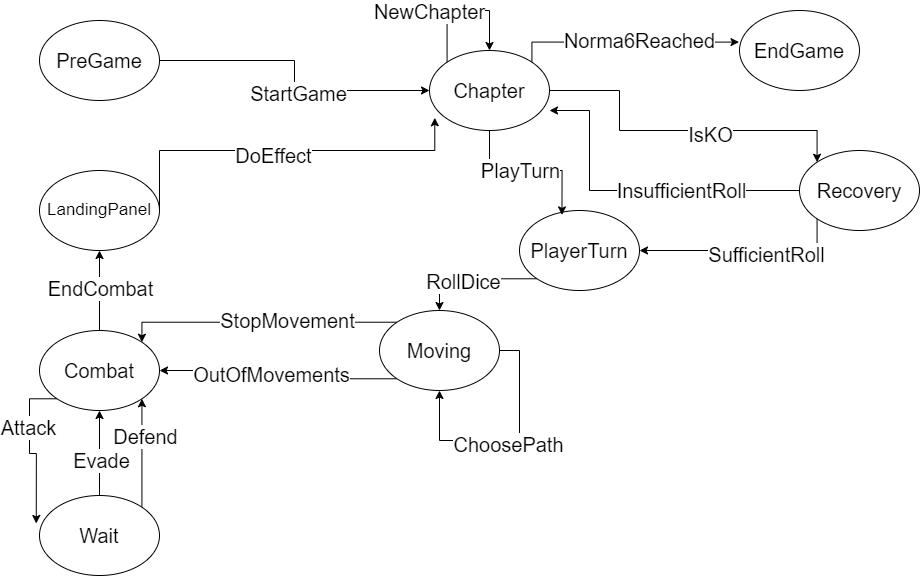

# 99.7% Citric Liquid

## About

`99.7% Citric Liquid` is a simplified clone of the renowned game, `100% Orange Juice`. Its main
purpose is to serve as an educational tool, teaching foundational programming concepts.

📢 **Note**: This project is purely educational and will not be used for any commercial purposes.

---

## For Students

The remainder of this README is yours to complete. Take this opportunity to describe your
contributions, the design decisions you've made, and any other information you deem necessary.

    

This project is licensed under the [Creative Commons Attribution 4.0 International License](http://creativecommons.org/licenses/by/4.0/).

---
## The Game: Citric Liquid 99.7%
This game is a simplified version of **100% Orange Juice**. It's a board game where 4 players can play a match, moving through the board with diffetent scenarios playing depending where they land. There're PVP and PVE battles, where the player's objects change, whether they win or loose.

The game's rounds are called *Chapters*, which number goes up each time all players have played their turn. To win, a player must reach *Norma 6*, and to get there they have to meet certain conditions, such as accumulating a certain number of *stars* or *wins*. These attributes start at 0, and the accumulate them by battling against eachother or against Wild Units,  by being lucky enough to land on a Bonus Panel or unlucky enough to land on a Drop Panel. 

On the other hand, *Wild Units* are the game's enemies. These ruthless little creatures just want to see players perish before them muahahaaha - excuse me, they want to see players unable to move to get their stars (can't say that, this is a family friendly game kekw). There are 3 different types of Wild Units: Chickens (of hell), Seagulls (food thiefs) and Robo Balls (?), each with specific stats and bonus stars if players are able to defeat them.

On another note, the board consist of different types of panels adjacent to one another, we have 5 types:

 - Neutral Panel: nothing happens here, pretty boring
 - Home Panel: each player owns one. When they land here, they get their HP restored and they get chekced if they can level up.
 - Bonus Panel: players gain stars :D .
 - Drop Panel: players loose stars D: .
 - Encounter Panel: a random Wild Unit appears here, ready to fight to death.

Also, if a player 'dies', ie, their HP reaches 0, they enter the *Recovery State*, where they can't play their turn unless they roll a certain number on the dice, quite sad.

And well, that's a quick overview of the game! Buh-bye.

---
## State Diagram

This diagram shows the overall game flow.
---
## Code Structure
My code is structured with the best design practices in mind. First of all, Scala separated its main package in *main* and *tests*. For this specific project, my main file is divided in quite a few packages, each containing common functionalities. For example, the *gameunits* package contains all of the game's entities, which are the Player Characters and Wild Units, the latter being divided in each specific type.
---
## Design Patterns
Two designs patters were implemented: **State** and **Observer**. The State Pattern was used because this project consist of various different states which need to be propperly separated and controlled. The Observer Pattern was used because the game needs to know when the match began and when victory was aquired by a player. 
