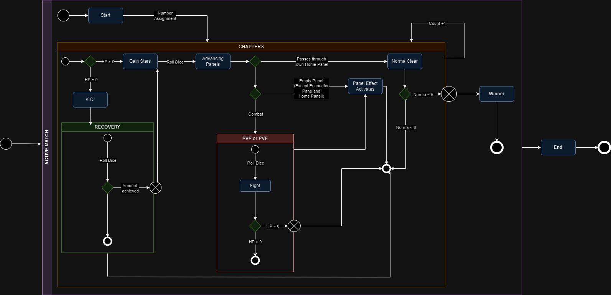

# 99.7% Citric Liquid

## About

`99.7% Citric Liquid` is a simplified clone of the renowned game, `100% Orange Juice`. Its main
purpose is to serve as an educational tool, teaching foundational programming concepts.

📢 **Note**: This project is purely educational and will not be used for any commercial purposes.

---

## For Students

The remainder of this README is yours to complete. Take this opportunity to describe your
contributions, the design decisions you've made, and any other information you deem necessary.

    

This project is licensed under the [Creative Commons Attribution 4.0 International License](http://creativecommons.org/licenses/by/4.0/).

---
## State Diagram (version 1.0)

This diagram shows the overall game flow, but from the perspective of ONE player, this means that this flow repeats for each player in the match. 

---
